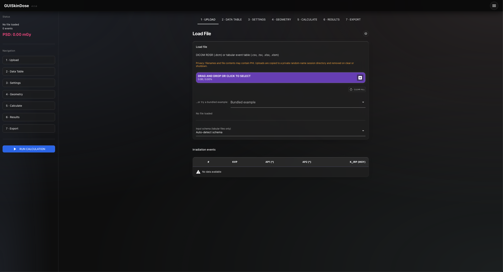
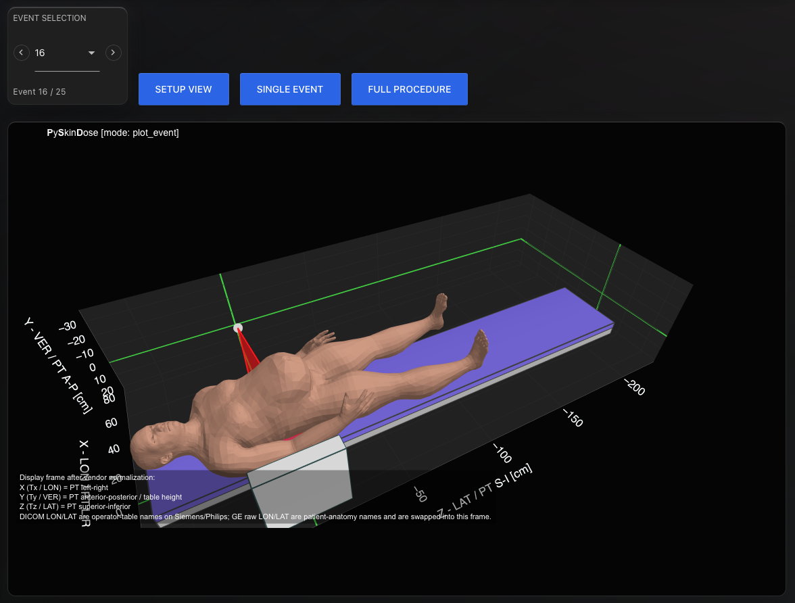
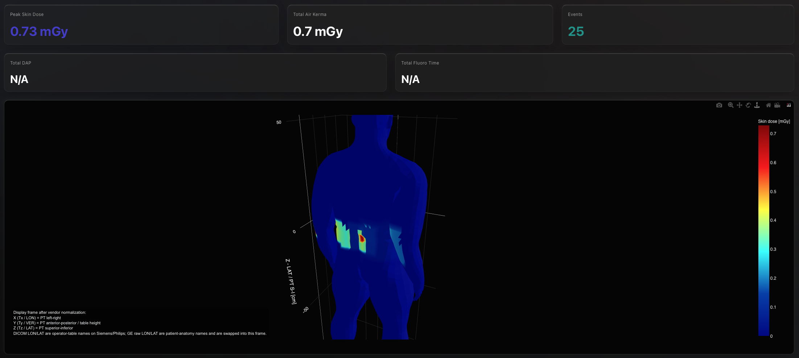
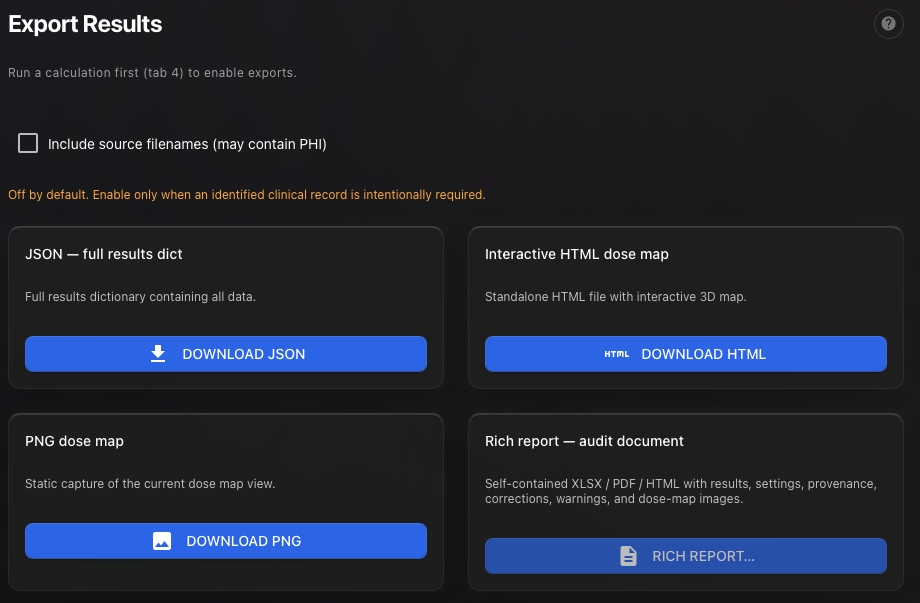

# GUISkinDose

**Independently maintained fork** of [PySkinDose](https://github.com/rvbCMTS/PySkinDose).
Original author: Max Hellström. This fork is **not** an official or endorsed
PySkinDose release unless upstream maintainers say otherwise.

Current maintainer: [@kgrizz-git](https://github.com/kgrizz-git) — see
[SUPPORT.md](SUPPORT.md) and [GOVERNANCE.md](GOVERNANCE.md).

GUISkinDose estimates **peak skin dose (PSD)** and **3D skin dose maps** for
fluoroscopic X-ray procedures. Load a DICOM RDSR (or a tabular event-table
export), preview the examination geometry, run the dose calculation, and export
an audit report — from a graphical interface or headlessly from scripts.

The distribution and import package name is `guiskindose` (distinct from upstream).

| Upload | Geometry |
|---|---|
|  |  |
| Results | Export |
|  |  |

*Captured with the bundled example data; no patient data.*

## Intended use and responsibility

GUISkinDose is intended for **research, education, development, and
institutional quality-assurance** workflows. It is **not FDA-cleared** (or
otherwise certified) as a medical device, and results are **not** independently
validated for making patient-care decisions on their own.

**Physicists and physicians remain responsible** for reviewing outputs,
confirming that inputs and geometry settings are appropriate, and making any
clinical or patient-care decisions. Do not treat dose maps or PSD values as a
substitute for professional judgment, institutional policy, or regulatory
clearance.

Never commit or attach real patient data to issues, pull requests, or the
repository — see [CONTRIBUTING.md](CONTRIBUTING.md) and
[dev-docs/PRIVACY_AND_SENSITIVE_ASSETS.md](dev-docs/PRIVACY_AND_SENSITIVE_ASSETS.md).

## Quick launch (GUI)

The typical way to use GUISkinDose is the NiceGUI-based graphical interface:
**Upload** (RDSR DICOM or tabular CSV/TSV/XLSX) → **Data** review →
**Settings** (phantom, physics, per-exam offsets) → **Geometry** preview →
**Calculate** → **Results** (PSD, dose map) → **Export** (JSON, dose-map
HTML/PNG, rich XLSX/PDF/DOCX report).

**macOS / Linux:**

```bash
chmod +x run_gui.sh   # one-time setup, enables executing the sh script
./run_gui.sh
```

**Windows:**

```bat
run_gui.bat
```

Both scripts prompt you to run in browser mode (default) or native window
mode. Or launch directly:

```bash
python -m guiskindose --mode gui              # browser mode
python -m guiskindose --mode gui --native     # native window (requires pywebview)

# or the equivalent installed console command:
guiskindose --mode gui [--native]
```

Example RDSR files ship under `src/guiskindose/example_data/RDSR/`. In-app
help on each tab mirrors `docs/source/gui_help/` (synced into the package at
build time).

Feature highlights: multi-exam aggregation with per-exam offsets, tabular
DoseTrack/Radimetrics imports with schema auto-detection, kerma-meter
correction keyed by equipment × tube, rich audit reports, and a human phantom
library with habitus scaling. Details in
[dev-docs/FEATURE_INVENTORY.md](dev-docs/FEATURE_INVENTORY.md) and the
[User guide](docs/source/user/user_guide.md).

### Privacy / network

The GUI has **no authentication** and loads PHI-derived RDSR data into a single
shared, process-global state. Browser mode binds to `127.0.0.1` (localhost
only) by default — reachable only from the machine it runs on.

Serving it to other hosts is opt-in via `--host`, which additionally requires
`--allow-network` as an explicit acknowledgement:

```bash
python -m guiskindose --mode gui --host 0.0.0.0 --allow-network   # serve on the LAN
```

Only do this on a trusted network, and behind your own access controls, since
anyone who can reach the port can view loaded patient data, trigger exports,
and mutate shared settings.

### Logging & privacy

The CLI and GUI log to the console (stderr) by default. **Native** mode has no
visible terminal, so diagnostic output is still emitted to stderr but may not be
easy to read unless you launch from a shell. No log file is written unless
`configure_logging(log_file=...)` is wired at startup (the optional file sink in
`guiskindose.debug` supports rotation and size caps when enabled).

To protect PHI, the app **does not log file names or paths** (RDSR filenames
often contain patient name/MRN/accession) — only file type, size, and event
counts. Verbose `DEBUG` output is opt-in per category via a `debug.json` in the
working directory, e.g.:

```json
{ "GUI": true, "PROCESSING": true, "CALCULATION": true, "RENDERING": true }
```

Even with debug enabled, identifiers are still redacted. Do not paste console
output into issues or commits without reviewing it for PHI first.

### Platform notes (Tkinter)

The GUI works fully without Tkinter, but uses it for two niceties: the native
**Save As** file dialog when exporting, and detecting your screen size to size
the native window. If Tkinter is missing you'll see a log line like
`No module named '_tkinter'`, exports fall back to a browser-style download, and
the window opens at a default size — nothing crashes.

Tkinter ships with Python but is only built when the Tcl/Tk libraries are present
at build time, so it can be absent (commonly with `pyenv` builds). It is **not** a
pip package — do not add it to the project dependencies. To install it:

| Platform | Command |
|---|---|
| macOS, Homebrew Python | `brew install python-tk` (or `python-tk@3.12` for a specific version) |
| macOS, pyenv Python | `brew install tcl-tk`, then reinstall the interpreter: `pyenv install 3.12.9` |
| Debian / Ubuntu | `sudo apt install python3-tk` |
| Fedora | `sudo dnf install python3-tkinter` |
| Windows | Included with the python.org installer — keep "tcl/tk and IDLE" checked |

Verify with: `python -c "import tkinter; print(tkinter.TkVersion)"`.

Native window mode remembers the last window size, position, and maximized state in
`~/.guiskindose/gui.json` (first launch opens maximized; Restore returns to the saved
normal size). Existing `~/.mypyskindose/gui.json` is still read when the new file is
absent.

## What this code is for

Within the intended-use boundary above, GUISkinDose is meant to be used in a few different ways:

1. Inspect or debug the examination geometry before doing dose calculations.
2. Step through irradiation events from an RDSR study to understand beam orientation and positioning.
3. Calculate a skin dose map on a mathematical or human phantom.
4. Export the calculation result as HTML, JSON, XLSX, PDF, or DOCX rich audit report, or as a Python dictionary for downstream processing.
5. Run the analysis headlessly from your own Python scripts.

## Installation

For local development, install the project in editable mode:

```bash
pip install -e .
```

To include the GUI dependencies:

```bash
pip install -e ".[gui]"
```

For full development setup (linting, testing, docs, Jupyter), install the
optional extras you need:

```bash
pip install -e ".[dev,gui]"             # lint/type/test toolchain + GUI
pip install -e ".[dev,gui,docs,notebooks]"   # everything (docs + JupyterLab)
```

If you only need the documentation tooling as well:

```bash
pip install -e ".[docs]"
```

## Requirements

- Python 3.11 or above
- A settings configuration, typically based on [src/guiskindose/settings_example.json](src/guiskindose/settings_example.json)
- A DICOM RDSR file (`.dcm`), a pre-parsed JSON export, or a supported tabular event-table export (`.csv`, `.tsv`, `.xlsx`)

## Headless use

### Command-line flags

Run `guiskindose --help` for the full list. Common headless examples:

```bash
guiskindose --file-path study.dcm
guiskindose --file-path events.csv --input-schema auto
guiskindose --file-path workbook.xlsx --sheet-name "Sheet1"
guiskindose --file-path study.dcm --export-format xlsx --export-path report.xlsx
```

Notable flags: `--input-schema` (default `auto` for tabular files), `--input-preview-only`,
`--export-format {xlsx,pdf,html,docx}`, `--export-path`, `--include-source-identifiers` (opt-in;
may include PHI-bearing source filenames in reports), `--kerma-meter-correction` and related
kerma-meter options.

### Scripted example

```python
from guiskindose import PyskindoseSettings, get_path_to_example_rdsr_files, load_settings_example_json
from guiskindose.main import main

settings = PyskindoseSettings(settings=load_settings_example_json())
settings.mode = "calculate_dose"
settings.output_format = "dict"
settings.phantom.model = "human"
settings.phantom.human_mesh = "hudfrid"

rdsr_dir = get_path_to_example_rdsr_files()
output = main(settings=settings, file_path=rdsr_dir / "siemens_axiom_example_procedure.dcm")

print(f"Estimated PSD: {output['psd']:.1f} mGy")
```

When `settings.output_format` is set to `dict` or `json`, the result can be used programmatically. The exported result includes items such as patient/table/pad data, event geometry, correction factors, dose map data, and peak skin dose. If you already have normalized RDSR data in a pandas `DataFrame`, use `analyze_normalized_data_with_custom_settings_object()` instead.

**New to GUISkinDose?** Prefer the GUI or the interactive getting-started notebook
([docs/source/getting_started/getting_started.ipynb](docs/source/getting_started/getting_started.ipynb);
run it via `pip install -e ".[notebooks]"` + `python scripts/open_getting_started_notebook.py`, which
opens an ignored local copy so experiments never dirty the tracked source).

## Useful helpers

The package includes helper functions that make exploration easier:

- `load_settings_example_json()` loads a ready-made settings template.
- `print_available_human_phantoms()` lists available human phantom meshes.
- `get_path_to_example_rdsr_files()` returns the folder containing bundled example RDSR files.
- `print_example_rdsr_files()` prints the bundled example filenames.

## Settings and modes

Important settings live in [src/guiskindose/settings_example.json](src/guiskindose/settings_example.json) and the settings classes under [src/guiskindose/settings](src/guiskindose/settings).

| Mode | What it does |
|---|---|
| `plot_setup` | Plot the initial geometry without loading an irradiation sequence |
| `plot_event` | Inspect one irradiation event |
| `plot_procedure` | Inspect the full event sequence |
| `calculate_dose` | Compute the dose map and peak skin dose estimate |

Common phantom models: `plane`, `cylinder`, `human`.

## Documentation

Documentation sources live under [docs/source](docs/source), including the getting-started notebook and user guide material.

To build the HTML documentation locally from this repository (use the `docs`
optional extra — there are no `requirements*.txt` files):

```bash
pip install -e ".[docs]"
python -m sphinx -b html docs/source docs/build/html
```

Then open the built site locally (path exists only after the Sphinx step above):

- `docs/build/html/index.html`

## Notes for this fork

- Independently maintained fork of [PySkinDose](https://github.com/rvbCMTS/PySkinDose); MIT license and upstream copyright preserved.
- Package identity: `guiskindose` (see [dev-docs/GUISKINDOSE_MIGRATION_STATUS.md](dev-docs/GUISKINDOSE_MIGRATION_STATUS.md)).
- How we maintain the fork: [dev-docs/FORK_MAINTAINER_GUIDE.md](dev-docs/FORK_MAINTAINER_GUIDE.md).
- Bugs and features: [GitHub Issues](https://github.com/kgrizz-git/GUISkinDose/issues) (templates require a no-PHI/PII confirmation; see [dev-docs/PRIVACY_AND_SENSITIVE_ASSETS.md](dev-docs/PRIVACY_AND_SENSITIVE_ASSETS.md)).
- Questions and contribution ideas: [GitHub Discussions](https://github.com/kgrizz-git/GUISkinDose/discussions). Ideas welcome — prefer Issues/Discussions over cold PRs ([CONTRIBUTING.md](CONTRIBUTING.md)).
- Security: [SECURITY.md](SECURITY.md). Support channels: [SUPPORT.md](SUPPORT.md).
