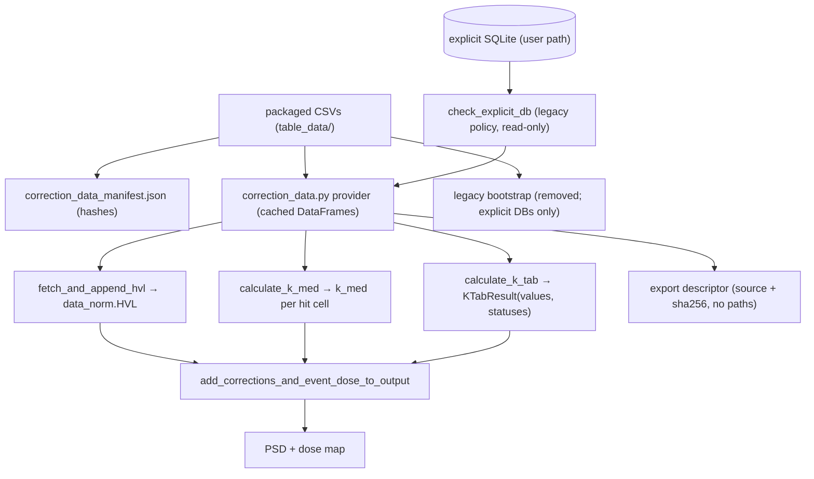

# Correction-Data Maintainer Reference

Source-to-lookup-to-dose map for the packaged correction data. User-facing
version: `docs/source/user/correction_data.md`. Machine-readable inventory:
`src/guiskindose/table_data/correction_data_manifest.json`. Plan history: the
active packaging/provenance master
(`plans/CORRECTION_DATA_PACKAGING_AND_PROVENANCE_PLAN.md`) plus archived Phase
plans in `plans/archive/`.

## Flow

## Table map

| Table (SQLite name) | Loader | Consumer | Output field | Fallback | Tests |
|---|---|---|---|---|---|
| `hvl_combined` (packaged `hvl_tables/hvl_combined.csv`) | `get_table` / explicit adapter | `geom_calc.fetch_and_append_hvl` | `data_norm.HVL` (mmAl) | Below-floor kVp policy (`snap`/`skip`/`manual`/`exam_average`); anode slice select + clamped interp | `test_geom_calc.py` HVL tests, `test_correction_data_provider.py` parity |
| `correction_medium_and_backscatter` (4-col projection) | `get_table` / explicit adapter | `corrections.calculate_k_med` | `k_med` per hit cell | Nearest tabulated field size → kVp → HVL (always resolves; no missing path) | `test_corrections.py`, provider parity |
| `correction_table_and_pad_attenuation` | `get_table` / explicit adapter | `corrections.calculate_k_tab` | `KTabResult(values, statuses)` | `estimate_k_tab=True` → constant `k_tab_val`, no DB read; unknown device/plane → 1.0 (`no_device`); invalid inherited (AlluraClarity Plane B zeros) → warned-neutral 1.0 | `test_corrections.py`, `test_k_tab_transmission_characterization.py`, `test_golden_k_tab.py` |
| `device_info` | Packaged CSV (no loader calls it; provenance only) | None (provenance only) | — | — | Manifest consistency + substitution tests |
| `hvl_allura_filters_11deg.csv`, `hvl_axiom_filters_8deg.csv` | `build_hvl_table.py` (dev) | None at runtime (build inputs) | — | — | Manifest `build_input` flags |
| `backscatter`, `h` columns | — | None (`k_bs` uses hard-coded polynomials + `CubicSpline` in `corrections.py:104-157`) | — | — | Manifest `runtime_read: false` flags |

## Key behaviors

- **No CWD writes.** Default runs never create files; a `corrections.db` file
  in the process working directory warns once per process (value-free) and is
  never loaded. (Only CWD is probed; the former GUI repo-root discovery was
  removed.)
- **Explicit databases** validate read-only (`correction_data.explicit_table()`
  + `check_explicit_db`) under the `legacy` policy
  (unversioned accepted with full content checks) and fail closed pre-
  calculation; validation and reads share one read-only connection inside an
  explicit read transaction. (`db_connect.py` opens explicit databases only and
  sits off the hot path; new code must use `correction_data.py`.)
- **Warnings** are once-per-process, keyed on source class, via `logger` +
  `DeprecationWarning`, honoring `emit_warnings=False`; never carry paths.
- **Exports** record `packaged`/`explicit` labels plus a
  `corrections_db_source` descriptor and hash (`RICH_EXPORT_SCHEMA_VERSION`
  2); raw paths never enter payloads.
- **Module** `db_connect.py` opens explicit databases read-only only; the
  bootstrap branch is deleted. New code must use `correction_data.py`.
