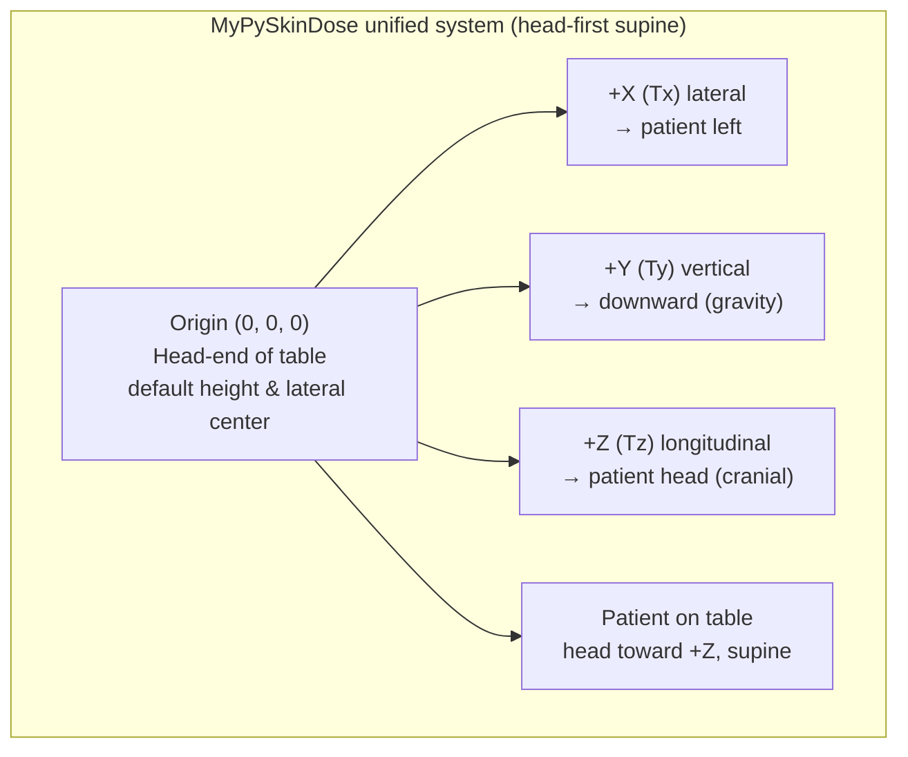
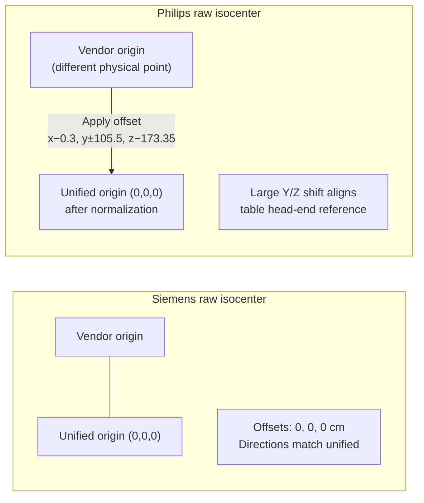
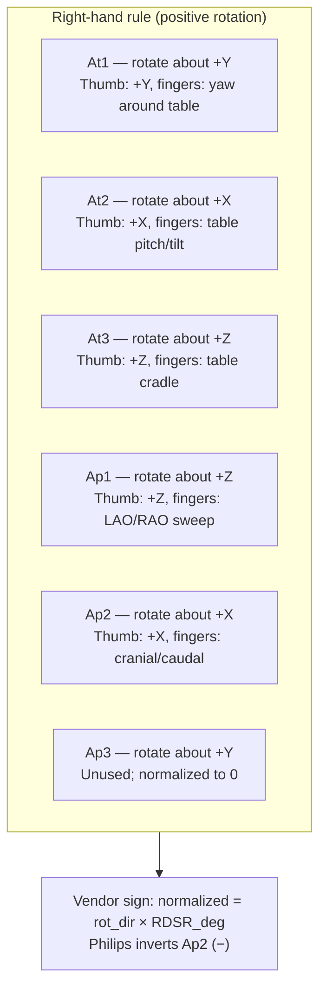
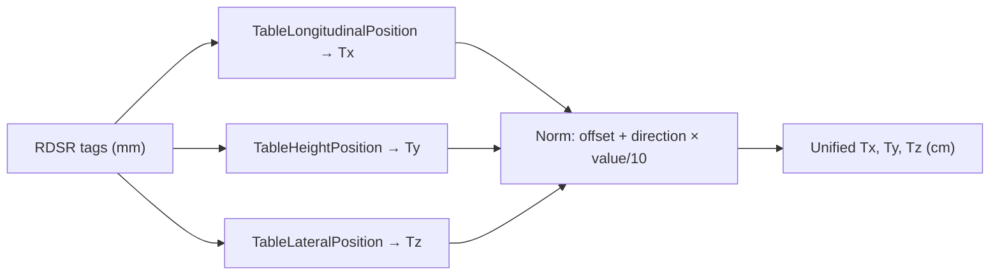
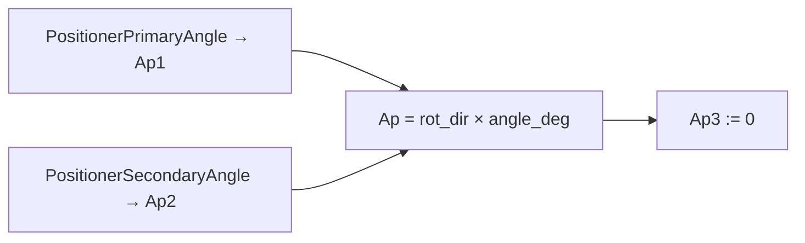
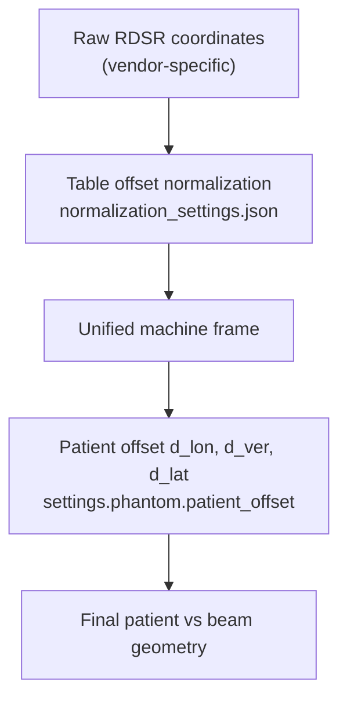
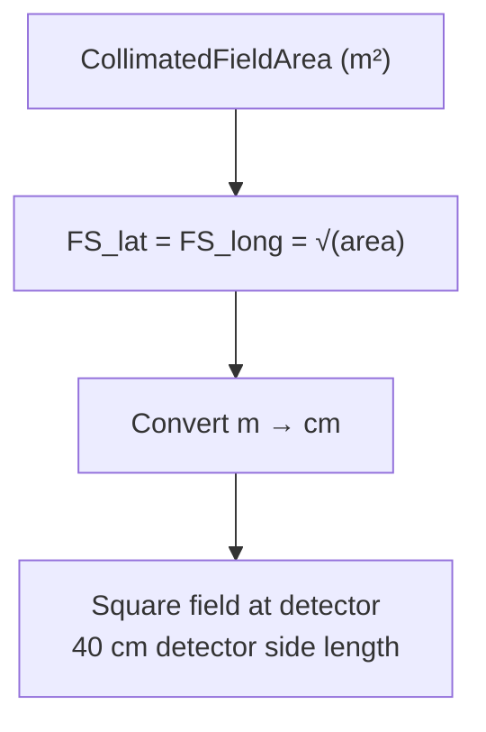
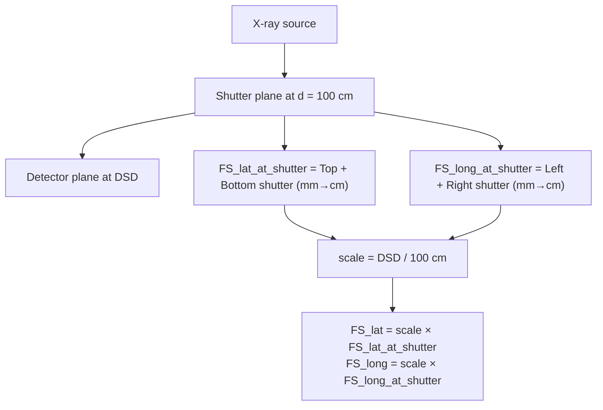

# Vendor-Specific Coordinate Systems and Normalization

This document explains how MyPySkinDose handles different fluoroscopy system manufacturers' coordinate systems and the transformations applied to normalize them into a unified internal representation.

## Overview

Different X-ray equipment manufacturers (Siemens, Philips, GE, Canon, etc.) use different conventions for:
- **Coordinate system origins** (where is the isocenter?)
- **Axis directions** (which way is "positive"?)
- **Rotation conventions** (clockwise vs counter-clockwise)
- **Field size calculations** (how beam dimensions are specified)

To ensure accurate dose calculations, MyPySkinDose normalizes all vendor-specific RDSR data into a **unified coordinate system** through the normalization pipeline (`rdsr_normalizer.py` + `normalization_settings.json`).

## Unified Internal Coordinate System

MyPySkinDose uses the following coordinate conventions internally:

### Axes
- **X-axis (Tx)**: Lateral (side-to-side), positive toward patient's left
- **Y-axis (Ty)**: Vertical (up-down), positive downward (gravity direction)
- **Z-axis (Tz)**: Longitudinal (head-foot), positive toward patient's head (cranial)

### Origin
- The `(0, 0, 0)` isocenter corresponds to the **head-end of the patient support table** at its default height and lateral center position

### Patient Position Default
- Patient in **head-first supine** position (lying on back, head toward positive Z)

### Rotations
All rotations follow the **right-hand rule**:
- **At1**: Table rotation about Y-axis (yaw)
- **At2**: Table tilt about X-axis (pitch)
- **At3**: Table cradle about Z-axis (roll)
- **Ap1**: X-ray source rotation about Z-axis (primary angle, LAO/RAO)
- **Ap2**: X-ray source rotation about X-axis (secondary angle, cranial/caudal)
- **Ap3**: Detector rotation about Y-axis (currently unused, set to 0)

## Vendor-Specific Transformations

The normalization system applies vendor-specific parameters to transform manufacturer coordinates into the unified system.

### Siemens (AXIOM-Artis)

```json
{
    "manufacturer": "Siemens",
    "models": ["AXIOM-Artis"],
    "translation_offset": {"x": 0.0, "y": 0.0, "z": 0.0},
    "translation_direction": {"x": "+", "y": "+", "z": "+"},
    "rotation_direction": {
        "Ap1": "+", "Ap2": "+", "Ap3": "+",
        "At1": "+", "At2": "+", "At3": "+"
    },
    "field_size_mode": "CFA",
    "detector_side_length": 40
}
```

**Key Points:**
- No coordinate origin offset needed
- All directions are positive (native Siemens coordinates align with internal system)
- Uses "CFA" (Collimated Field Area) mode for field size calculations
- Detector is 40 cm square

### Philips (Allura Clarity)

```json
{
    "manufacturer": "Philips",
    "models": ["Allura Clarity"],
    "translation_offset": {"x": -0.3, "y": 105.5, "z": -173.35},
    "translation_direction": {"x": "+", "y": "-", "z": "+"},
    "rotation_direction": {
        "Ap1": "+", "Ap2": "-", "Ap3": "+",
        "At1": "+", "At2": "+", "At3": "+"
    },
    "field_size_mode": "ASD",
    "detector_side_length": 40
}
```

**Key Points:**
- **Large translation offset** required (especially Y: 105.5 cm, Z: -173.35 cm)
- **Y-axis inverted**: Philips table height increases in opposite direction
- **Ap2 inverted**: Philips secondary positioner angle (cranial/caudal) is reversed
- Uses "ASD" mode for field size calculations

**What This Means:**
Philips systems define their isocenter at a significantly different physical location than Siemens. The large Y and Z offsets shift the Philips coordinate origin to match the unified system's table head-end reference.

### Default (Fallback)

```json
{
    "manufacturer": "Default",
    "models": ["Default"],
    "translation_offset": {"x": 0.0, "y": 0.0, "z": 0.0},
    "translation_direction": {"x": "+", "y": "+", "z": "+"},
    "rotation_direction": {
        "Ap1": "+", "Ap2": "+", "Ap3": "+",
        "At1": "+", "At2": "+", "At3": "+"
    },
    "field_size_mode": "CFA",
    "detector_side_length": 40
}
```

**Key Points:**
- Mirrors Siemens conventions (assumes Siemens-like coordinates)
- Used when no specific manufacturer/model match is found

## Transformation Implementation

The normalization happens in `rdsr_normalizer.py`. Here's how the transformations are applied:

### Table Position (Translation)
```python
data_norm["Tx"] = norm.trans_offset.x + norm.trans_dir.x * data_parsed.TableLongitudinalPosition_mm / 10
data_norm["Ty"] = norm.trans_offset.y + norm.trans_dir.y * data_parsed.TableHeightPosition_mm / 10
data_norm["Tz"] = norm.trans_offset.z + norm.trans_dir.z * data_parsed.TableLateralPosition_mm / 10
```

**Process:**
1. Convert mm to cm (divide by 10)
2. Apply direction sign (`+1` or `-1`)
3. Add translation offset

### Beam Angles (Rotation)
```python
data_norm["Ap1"] = norm.rot_dir.Ap1 * data_parsed.PositionerPrimaryAngle_deg
data_norm["Ap2"] = norm.rot_dir.Ap2 * data_parsed.PositionerSecondaryAngle_deg
data_norm["Ap3"] = norm.rot_dir.Ap3 * [0] * len(data_norm)
```

**Process:**
1. Multiply angle by direction sign (`+1` or `-1`)
2. Ap3 is currently always set to 0

### Table Rotations
```python
data_norm["At1"] = norm.rot_dir.At1 * [0] * len(data_norm)
data_norm["At2"] = norm.rot_dir.At2 * [0] * len(data_norm)
data_norm["At3"] = norm.rot_dir.At3 * [0] * len(data_norm)
```

**Current State:**
Table rotations are currently always set to 0 (not extracted from RDSR data yet).

## Unsupported Vendors

### GE Healthcare
**Status**: Not currently in the normalization database.

If a GE RDSR is loaded, the system will fall back to "Default" settings (Siemens-like conventions). This **may produce incorrect dose projections** if GE uses different coordinate conventions.

**Risk**: High for incorrect dose localization if GE conventions differ significantly.

### Canon (formerly Toshiba)
**Status**: Not currently in the normalization database.

Same fallback behavior as GE.

### Other Vendors
Any vendor not explicitly listed will use the "Default" settings, which assume Siemens-like coordinate conventions.

## How Normalization is Selected

The normalization matching process (in `normalization_settings.py`):

1. **Extract manufacturer and model** from RDSR:
   - `Manufacturer` DICOM tag (e.g., "Philips")
   - `ManufacturerModelName` DICOM tag (e.g., "Allura Clarity")

2. **Case-insensitive matching**:
   - Convert both RDSR values and normalization entries to lowercase
   - Match `manufacturer` exactly
   - Match `model` against list of known models

3. **Fallback to Default**:
   - If no match found, log warning and use "Default" entry
   - If no "Default" entry exists, raise `NotImplementedError`

## The Two Offset Systems

MyPySkinDose uses **two separate offset systems** that work together to position the patient correctly:

### 1. Table Offsets (Vendor-Specific Machine Coordinates)

**Purpose**: Transform manufacturer-specific coordinates into MyPySkinDose's unified coordinate system.

**Applied**: Automatically during RDSR normalization.

**Source**: `normalization_settings.json` (matched by manufacturer/model).

**User Control**: Currently read-only in the GUI (shown in Results tab). Future versions may allow manual adjustment.

**Example**: Philips Allura requires `{x: -0.3, y: 105.5, z: -173.35}` cm because Philips defines their isocenter at a different physical location than the unified system's origin.

### 2. Patient Offsets (User-Adjustable Positioning)

**Purpose**: Position the patient mesh on the table relative to the table's coordinate system.

**Applied**: During dose calculation (after normalization).

**Source**: `settings.phantom.patient_offset` (`d_lon`, `d_ver`, `d_lat`).

**User Control**: Editable in the Settings tab (`d_lon`, `d_ver`, `d_lat` parameters).

**Example**: If the patient's head should be positioned 20 cm down from the table head-end for a cardiac procedure, set `d_lon = 20`.

### The Transformation Hierarchy

1. **Raw RDSR coordinates** (manufacturer-specific, e.g., Philips table height = 105.5 cm)
2. → **Table Offset applied** (normalization step: `105.5 + (-105.5) = 0` cm in unified system)
3. → **Patient Offset applied** (calculation step: shift patient mesh by `d_lon`, `d_ver`, `d_lat`)
4. → **Final patient position** relative to beam geometry

### Why Two Systems?

- **Table Offsets** are **machine-specific** and should be consistent for all procedures on the same scanner model.
- **Patient Offsets** are **procedure-specific** and depend on how the patient was actually positioned during the exam.

### GUI Display

- **Settings Tab**: Shows Patient Offsets (`d_lon`, `d_ver`, `d_lat`) as editable fields
- **Results Tab**: Shows Table Offsets (read-only, applied automatically)
- **Future Enhancement**: Display both offset types in Settings tab, with Table Offsets shown as read-only (initially) and Patient Offsets as editable

## Common Issues and Debugging

### Dose Projects to Wrong Body Part

**Symptom**: Beam hits the head during cardiac procedure, or vice versa.

**Likely Causes**:
1. **Missing/incorrect normalization entry** for the vendor/model
2. **Incorrect `patient_offset`** in settings (patient positioned wrong on table)
3. **RDSR data quality issues** (missing or corrupted position data)

**Debugging Steps**:
1. Check if vendor/model exists in `normalization_settings.json`
2. Verify the normalized coordinates in the RDSR table (GUI "Data" tab)
3. Adjust `patient_offset` parameters and preview in "Geometry" tab
4. Compare with known-good RDSR from same vendor/model

### Table Height Seems Inverted

**Symptom**: Table moves up when it should move down, or vice versa.

**Likely Cause**: `translation_direction.y` sign is incorrect for this vendor.

**Solution**: Add or update vendor entry with correct Y-axis direction.

### Rotations Appear Backwards

**Symptom**: LAO shows as RAO, or cranial shows as caudal.

**Likely Cause**: `rotation_direction` signs are incorrect.

**Solution**: Add or update vendor entry with correct rotation directions.

## Field Size Calculation Modes

Different vendors specify beam collimation differently:

### CFA (Collimated Field Area)
Used by: Siemens, Default

The field size is calculated based on the collimated field area dimensions provided in the RDSR.

### ASD (Alternative Size Definition)
Used by: Philips

Philips systems may provide field size information in a different format that requires alternative calculation methods.

**Implementation**: See `geom_calc.calculate_field_size()` for mode-specific logic.

## Adding Support for New Vendors

To add normalization support for a new vendor/model:

1. **Collect sample RDSR files** from the target system
2. **Analyze coordinate conventions**:
   - What is the isocenter origin location?
   - Which directions are positive?
   - How are rotations defined?
3. **Determine required offsets**:
   - Compare known-good geometry with default processing
   - Calculate translation offsets to align origins
   - Determine direction signs by testing known positions
4. **Add entry to `normalization_settings.json`**:
   ```json
   {
       "manufacturer": "VendorName",
       "models": ["Model1", "Model2"],
       "translation_offset": {"x": X.X, "y": Y.Y, "z": Z.Z},
       "translation_direction": {"x": "±", "y": "±", "z": "±"},
       "rotation_direction": {
           "Ap1": "±", "Ap2": "±", "Ap3": "±",
           "At1": "±", "At2": "±", "At3": "±"
       },
       "field_size_mode": "CFA or ASD",
       "detector_side_length": 40
   }
   ```
5. **Test with multiple RDSRs** from that vendor/model
6. **Validate dose projections** against known results or clinical expectations

## Related Documentation

- **[INPUT_DATA_FLOW_AND_OFFSETS.md](INPUT_DATA_FLOW_AND_OFFSETS.md)** — Overview of data flow and offset concepts
- **[CODEBASE_OVERVIEW.md](CODEBASE_OVERVIEW.md)** — Full system architecture
- **`normalization_settings.json`** — The actual normalization database
- **`rdsr_normalizer.py`** — Normalization implementation code

## Coordinate system diagrams

> **Initial diagram set (2026-06-06); expand as vendor data is validated.**

Text-based Mermaid diagrams below summarize conventions described earlier in this document. They are schematic—not to scale—and intended for orientation during debugging and vendor onboarding.

### 1. Unified internal coordinate system

**Caption:** Internal axes, origin, and default patient orientation. Positive directions follow the labels on each axis arrow.



**Rotation axes (all right-hand rule):**

| Symbol | Axis of rotation | Role |
|--------|------------------|------|
| At1 | Y (yaw) | Table rotation |
| At2 | X (pitch) | Table tilt |
| At3 | Z (roll) | Table cradle |
| Ap1 | Z | Primary positioner (LAO/RAO) |
| Ap2 | X | Secondary positioner (cranial/caudal) |
| Ap3 | Y | Detector rotation (unused; set to 0) |

### 2. Siemens vs Philips coordinate origins

**Caption:** Siemens AXIOM-Artis coordinates align with the unified origin (zero offset). Philips Allura Clarity defines isocenter elsewhere; normalization shifts raw table coordinates into the unified frame.

| Aspect | Siemens (AXIOM-Artis) | Philips (Allura Clarity) |
|--------|----------------------|--------------------------|
| Translation offset | `{x: 0, y: 0, z: 0}` cm | `{x: -0.3, y: 105.5, z: -173.35}` cm |
| Y direction | `+` (same as unified) | `-` (table height inverted) |
| Ap2 direction | `+` | `-` (cranial/caudal reversed) |
| Field size mode | CFA | ASD |



After normalization, both vendors express table position and beam geometry in the same unified `(Tx, Ty, Tz)` and `(Ap1, Ap2, …)` frame.

### 3. Right-hand rule for rotations

**Caption:** For each angle, curl the fingers of your right hand in the direction of positive rotation; your thumb points along the positive axis of rotation. Vendor `rotation_direction` signs flip the RDSR angle when the manufacturer uses the opposite convention.



### 4. Table position and beam angle conventions

**Caption:** RDSR DICOM tags are converted to cm, signed per vendor, and offset into unified coordinates. Beam angles are multiplied by vendor rotation signs. Table rotations (`At1`–`At3`) are currently forced to 0 pending RDSR extraction.

**Table translation (normalization):**



**Beam angles (normalization):**



**Hierarchy (table offset then patient offset):**



### 5. Field size calculation geometry

**Caption:** Field size at the detector plane depends on vendor mode. CFA (Siemens, Default) uses collimated field area as a square. ASD (Philips) scales shutter openings measured at 100 cm from the source to the detector distance (`DSD`).

**CFA — Collimated Field Area (Siemens, Default):**



**ASD — Actual Shutter Distance (Philips):**



See `geom_calc.calculate_field_size()` for implementation details.

## Tabular input coordinate handling

When tabular data (CSV/TSV/XLSX) is imported via the `input_adapters/` layer, the coordinate handling depends on which schema adapter is used and what coordinate frame the exported values are in.

### The core question for each vendor export

Before writing a Phase 3–4 vendor adapter (Radimetrics, DoseTrack, etc.), the first thing to determine is **which coordinate frame the exported values are in**:

| Export coordinate frame | Correct normalization path | Risk if wrong |
|---|---|---|
| Raw DICOM frame (same as `rdsr_parser()` output) | Use `generic_rdsr_like` adapter → `rdsr_normalizer()` applies corrections from `normalization_settings.json` once | None if confirmed |
| Already fully normalized (e.g., by MyPySkinDose itself) | Use `normalized` schema adapter; do not call `rdsr_normalizer()` | None if confirmed |
| Pre-transformed by vendor software (unknown convention) | Must investigate before writing adapter | Risk of double-correction or missed correction — silently wrong geometry |

**Radimetrics, DoseTrack, and similar dose-management systems** are expected to pass coordinate values through from the underlying RDSR verbatim (raw DICOM frame). If so, the `generic_rdsr_like` path is correct. **Confirm this per vendor** by comparing a real export side-by-side with its source RDSR before writing each adapter.

### Double-correction risk

Calling `rdsr_normalizer()` on data that has already been transformed doubles the corrections — producing obviously wrong positions for Philips (large Y/Z offsets) and GE (axis swap), and no numerical effect for Siemens (all-zero offsets):

| Manufacturer | Double-correction effect | Risk level |
|---|---|---|
| Siemens (AXIOM-Artis) | No effect (offsets are all zero) | Low |
| Philips (Allura Clarity) | Large position error (~105 cm Y, ~173 cm Z) | High |
| GE (if axis swap applied twice) | Lateral/longitudinal axes wrong | High |
| Unknown/unvalidated vendor | Unknown | Assume high |

### Lateral/longitudinal axis swap — GE and DoseTrack Philips

The axis swap problem affects more than just GE DICOM RDSRs. It occurs whenever the **`TableLateralPosition` and `TableLongitudinalPosition` values are physically swapped** relative to the internal model's axis definitions, regardless of source:

- **GE DICOM RDSRs**: the DICOM tags themselves are swapped relative to the unified system.
- **DoseTrack Philips exports**: the `dhen2714/PySkinDose` reference implementation explicitly swaps `TableLateralPosition_mm ↔ TableLongitudinalPosition_mm` in its `parse_philips()` function — suggesting DoseTrack stores Philips data with these axes swapped.
- Possibly other vendor/export-tool combinations: must be verified per adapter.

The `normalization_settings.json` offset/direction mechanism cannot fix an axis swap — it requires explicitly transposing the two columns before `rdsr_normalizer()` is called. Note that `normalization_settings.json` maps **Longitudinal → Tx (lateral)** and **Lateral → Tz (longitudinal)**, so calling `rdsr_normalizer()` on swapped data produces axes in entirely the wrong positions.

The fix is a `swap_lateral_longitudinal` option applied before `rdsr_normalizer()` — either as a per-manufacturer flag or as an explicit step in each adapter that needs it. The shipped `TabularImportOptions` path uses `swap_lateral_longitudinal=True` to pre-swap the columns before normalization.

### User-selectable import options (`TabularImportOptions`, Phase 3+)

To let expert users override incorrect defaults, `read_and_normalize_input()` will accept an optional `TabularImportOptions` dataclass:

```python
@dataclass
class TabularImportOptions:
    swap_lateral_longitudinal: bool = False      # swap TableLateralPosition ↔ TableLongitudinalPosition
    skip_manufacturer_transforms: bool = False   # bypass rdsr_normalizer() coordinate step
    custom_translation_offset: dict | None = None  # override normalization_settings.json offset
```

These options will be exposed in the GUI as toggles in the import preview step (see `TABULAR_RDSR_INPUT_PLAN.md` Phase 5 GUI changes section), and as `--swap-lat-lon` / `--skip-transforms` CLI flags.

---

## Future Work

- Expand coordinate system diagrams as more vendors are validated (GE, Canon, etc.)
- Expand vendor support (GE, Canon, Ziehm, etc.)
- Add GUI warnings when unsupported vendor/model is detected
- Implement automatic offset calibration from phantom scans
- Add coordinate system validation tests
- Document field size calculation modes in detail
- Support for table rotations (At1, At2, At3) from RDSR data
