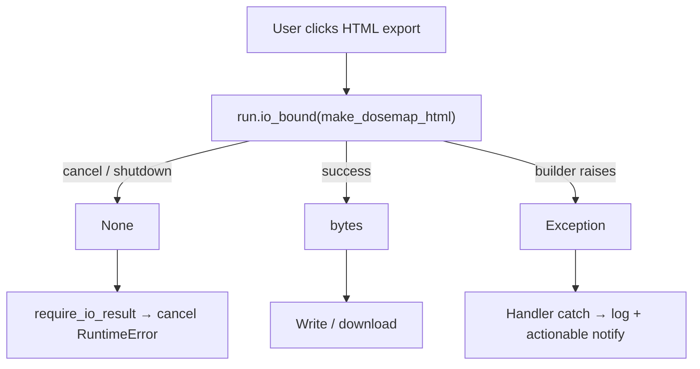

# HTML Export Error Reporting & Fix Plan

> **For agentic workers:** REQUIRED SUB-SKILL: Use superpowers:subagent-driven-development (recommended) or superpowers:executing-plans to implement this plan task-by-task. Steps use checkbox (`- [ ]`) syntax for tracking.

**Goal:** Stop HTML/PNG export from reporting a fake “Background task was cancelled” error; capture the real failure; fix the underlying render bug once known; leave users with an actionable message.

**Architecture:** Keep NiceGUI’s interim `run.io_bound` → `None` = cancel contract via `require_io_result`. Change export builders so failure **raises** (logged via `safe_error_event`) instead of returning `None`. Export handlers catch builder failures separately from cancel. Phase 0 captures the unknown exception; Phase 2 fixes it with a decision tree based on that evidence.

**Tech Stack:** Python 3.10+, NiceGUI `run.io_bound`, Plotly `Figure.to_html` / `to_image`, pytest, existing `safe_error_event` / `safe_user_error` privacy helpers.

**Source assessment:** [assessments/HTML_EXPORT_BACKGROUND_TASK_ERROR_20260719T123241.md](../assessments/HTML_EXPORT_BACKGROUND_TASK_ERROR_20260719T123241.md)  
**TO_DO item:** Fix download/export HTML button

## Global Constraints

- Do not log PHI/PII, source filenames, or absolute paths (`safe_error_event` only).
- Do not remove `require_io_result` until NiceGUI 4.0 raises `CancelledError` on cancel.
- PNG must get the same error-semantics treatment as HTML in the same PR series.
- Keep GUI modules under ~800 lines; prefer small edits in `figures.py` / `export.py` / `concurrency.py`.
- Prefer raise-on-failure over a Result/sentinel wrapper (NiceGUI dropped a similar sentinel for 4.0).
- Manual GUI smoke that reuses the user’s multi-exam session is required before calling Phase 2 done.
- Scratch scripts and repro outputs go under gitignored `tmp/` only.

---

## Why Phase 0 exists (research first, but not blocking forever)

We know the **symptom mechanism** (builder `None` → `require_io_result` cancel message). We do **not** yet know the **concrete exception** behind the user’s failure. Results aggregate map rendered with the same multi-exam inputs, so mesh mismatch is unlikely; `to_html` / worker-thread / second-call failure is the leading guess.

Phase 0 answers that question with minimal instrumentation.  
Phases 1 and 3 (error semantics + tests) are valuable even if Phase 0 takes a day — they stop lying to the user and make the next failure diagnosable. **Do not claim the user bug is fixed until Phase 0 evidence + Phase 2 land.**



---

## File map

| File | Role in this plan |
|------|-------------------|
| `src/mypyskindose/gui/figures.py` | `make_dosemap_html` / `make_dosemap_png` / `make_dosemap_fig` — stop silent `None`; log + raise |
| `src/mypyskindose/gui/tabs/export.py` | `download_html` / `download_png` — catch builder errors vs cancel; fix dead notify branch |
| `src/mypyskindose/gui/concurrency.py` | Keep `require_io_result`; optionally tighten docstring only |
| `tests/unittests/test_gui_figures.py` | Unit tests for raise-on-failure + successful HTML bytes |
| `tmp/` (gitignored) | Phase 0 scratch repro / captured logs — never commit |
| `CHANGELOG.md` | Fixed entry under `[Unreleased]` |
| `dev-docs/TO_DO.md` | Check off when Phase 2+3 complete |
| Assessment doc | Append Phase 0 findings |

---

### Task 0: Phase 0 — Capture the real exception (research / experiments)

**Files:**
- Modify (temporary or permanent): `src/mypyskindose/gui/figures.py` — logging in `make_dosemap_html` / `make_dosemap_png`
- Optional scratch: `tmp/repro_dosemap_html_export.py` (gitignored)
- Update: `dev-docs/assessments/HTML_EXPORT_BACKGROUND_TASK_ERROR_20260719T123241.md` (findings appendix)

**Interfaces:**
- Consumes: existing `make_dosemap_fig`, `safe_error_event`
- Produces: a recorded exception type + message (privacy-safe) that Phase 2 must address

#### Experiment A — instrument and reproduce in the GUI (required)

- [x] **Step 0.1: Add logging to the silent HTML/PNG except blocks**

In `make_dosemap_html` and `make_dosemap_png`, replace bare `except Exception: return None` with:

```python
except Exception as exc:
    safe_error_event(logger, "dosemap_html_render", exc)  # or "dosemap_png_render"
    return None  # temporary: keep return None so Phase 0 still shows the cancel symptom OR raise — either is fine if the log line appears
```

Prefer **still returning `None` for this step only** if you want an unchanged UI while confirming the log fires; or raise early if combining with Task 1 in one sitting.

- [ ] **Step 0.2: Reproduce the user’s path**

> **Not completed — see comment.** Ran the *non-interactive* equivalent instead (per the task
> brief's preference: "prefer a non-interactive path if possible"): built a real
> `MultiExamResult` from bundled RDSR fixtures via `analyze_multiple_exams` and called
> `make_dosemap_html`/`make_dosemap_png` with the exact `export.py` argument shape, for both
> `cylinder` and `human` phantom models. **No failure reproduced** — no exception, no
> `dosemap_html_render`/`dosemap_png_render` log line fired. The interactive GUI path with the
> user's actual original session/dataset was **not** attempted in this dispatch, so this step's
> stated goal (capture the real exception from the user's path) is not met. See the Phase 0
> finding block appended to the assessment doc for full detail and open follow-ups. Do not mark
> this done until either an interactive-GUI repro captures the exception, or Phase 1's
> raise-on-failure change surfaces it in the wild.

1. Activate `.venv`, launch GUI: `python -m mypyskindose --mode gui`
2. Load the same multi-exam set that previously failed (or closest available fixtures)
3. Calculate → confirm Results aggregate map renders
4. Export → HTML
5. Capture the new `dosemap_html_render` log line (exception class + safe message)

Record in the assessment appendix (no filenames/PHI):

```markdown
### Phase 0 finding (YYYY-MM-DD)
- Exception type: ...
- Operation key: dosemap_html_render
- Happened after Results aggregate rendered: yes/no
- PNG tried: yes/no — result: ...
- Worker-thread only?: unknown | yes | no (see Experiment B)
```

#### Experiment B — isolate `to_html` off the UI thread (recommended if A is ambiguous)

- [x] **Step 0.3: Scratch script under `tmp/`**

Ran as `tmp/repro_dosemap_html_export.py` (gitignored, deleted after this dispatch per the
scratch-cleanliness convention — reproducible from this checklist item if needed again). Compared
main-thread vs. `ThreadPoolExecutor` for both `to_html` and `to_image`(kaleido/PNG) plus a
concurrent-call race probe; all succeeded identically with no thread-only difference. See the
Phase 0 finding block in the assessment doc.

Build a minimal figure the same way Results does, then call `to_html` on the main thread and via `concurrent.futures.ThreadPoolExecutor` (mirrors `run.io_bound`). Do **not** commit the script.

```python
# tmp/repro_dosemap_html_export.py — outline only
# 1) Load or synthesize multi-exam-like dose_map + patient dict
# 2) fig_dict = make_dosemap_fig(explicit_dose_map=..., explicit_patient=...)
# 3) html = go.Figure(fig_dict).to_html(full_html=True)  # main thread
# 4) Same call inside ThreadPoolExecutor.submit(...).result()
# Compare: success/fail and exception types
```

Expected outcomes and Phase 2 routing:

| Outcome | Phase 2 action |
|---------|----------------|
| `to_html` fails only in a worker thread | Prefer UI-thread export for HTML, or build fig on worker then `to_html` on loop with a clear comment; document NiceGUI constraint |
| `to_html` fails on both threads | Fix Plotly/data issue (size, invalid mesh, encoding); may need `include_plotlyjs` / CDN options or mesh sanitization |
| `make_dosemap_fig` returns `None` on second call but Results had a fig | Investigate `state` mutation / race; consider exporting from `state.dosemap_fig` when present |
| No exception; genuine NiceGUI `None` (cancel) | Investigate client disconnect / busy guard / overlapping ops — different fix |
| PNG fails, HTML works (or reverse) | Split fixes; kaleido vs `to_html` |

- [x] **Step 0.4: Smoke PNG on the same run**

Same non-interactive session: `make_dosemap_png` called with the same multi-exam args, main
thread + worker thread + concurrently. All succeeded (71,802 bytes with the `human` phantom);
no `dosemap_png_render` log fired. Same outcome as HTML — no PNG/HTML asymmetry found.

- [ ] **Step 0.5: Gate**

> **Gate condition NOT met — Phase 2 must not start from this evidence.** Neither Experiment A
> captured an exception type, nor did Experiment B prove a thread-only failure. Recorded as an
> open item in the assessment's Phase 0 finding block with three candidate explanations for
> follow-up (real-dataset data-shape/size issue, genuine NiceGUI cancel, or a live-process-only
> interaction). Phase 1 may still proceed per the plan's own note.

---

### Task 1: Phase 1 — Error semantics (stop lying; raise + actionable UI)

**Files:**
- Modify: `src/mypyskindose/gui/figures.py`
- Modify: `src/mypyskindose/gui/tabs/export.py`
- Test: `tests/unittests/test_gui_figures.py`

**Interfaces:**
- Consumes: `require_io_result`, `safe_error_event`, `safe_user_error`
- Produces: `make_dosemap_html(...) -> bytes` (raises on failure); `make_dosemap_png(...) -> bytes` (raises on failure); export handlers that distinguish cancel vs render failure

- [x] **Step 1.1: Write failing tests**

Append to `tests/unittests/test_gui_figures.py`:

```python
def test_make_dosemap_html_returns_html_bytes():
    from mypyskindose.gui.figures import make_dosemap_html

    patient = {
        "patient": {
            "patient_skin_cells": {
                "x": [0.0, 1.0, 0.0],
                "y": [0.0, 0.0, 1.0],
                "z": [0.0, 0.0, 0.0],
            },
            "triangle_vertex_indices": {"i": [0], "j": [1], "k": [2]},
        }
    }
    content = make_dosemap_html(explicit_dose_map=[1.0, 2.0, 3.0], explicit_patient=patient)
    assert isinstance(content, bytes)
    assert b"<html" in content.lower() or b"plotly" in content.lower()


def test_make_dosemap_html_raises_when_fig_unavailable(monkeypatch):
    from mypyskindose.gui import figures

    monkeypatch.setattr(figures, "make_dosemap_fig", lambda *a, **k: None)
    with pytest.raises(RuntimeError, match="could not be built|Dose map"):
        figures.make_dosemap_html(explicit_dose_map=[1.0], explicit_patient={"patient": {}})
```

- [x] **Step 1.2: Run tests — expect failure**

```bash
source .venv/bin/activate
pytest tests/unittests/test_gui_figures.py -v
```

Expected: new tests fail (current API returns `None` / does not raise).

> **Done (2026-07-19).** RED confirmed: 4 failed / 3 passed — `test_make_dosemap_html_raises_when_fig_unavailable`,
> `test_make_dosemap_png_raises_when_fig_unavailable`, and two supplementary
> logs-on-exception tests failed with `DID NOT RAISE`; the pre-existing coordinate-frame
> test and the two new "returns bytes" tests (which don't depend on raise behavior) passed.
> Full transcript in `.superpowers/sdd/task-1-report.md`.

- [x] **Step 1.3: Change builders to log + raise**

Target shape for `make_dosemap_html` (mirror for PNG):

```python
def make_dosemap_html(explicit_dose_map=None, explicit_patient=None) -> bytes:
    """Render the dose map as a standalone interactive HTML document."""
    try:
        fig_dict = make_dosemap_fig(
            explicit_dose_map=explicit_dose_map, explicit_patient=explicit_patient
        )
        if fig_dict is None:
            raise RuntimeError("Dose map figure could not be built")
        import plotly.graph_objects as go

        fig = go.Figure(fig_dict)
        return fig.to_html(full_html=True).encode()
    except Exception as exc:
        safe_error_event(logger, "dosemap_html_render", exc)
        raise
```

Keep `make_dosemap_fig` returning `None` for Results (empty plot is OK there), but bump its log level to WARNING when used from export paths **or** leave DEBUG and rely on the HTML wrapper’s WARNING — either is fine; the export wrapper must always log at default `safe_error_event` level.

- [x] **Step 1.4: Fix export handlers**

In `download_html` / `download_png`, wrap the `require_io_result(await run.io_bound(...))` call:

```python
try:
    content = require_io_result(
        await run.io_bound(make_dosemap_html, explicit_dose_map, explicit_patient)
    )
except RuntimeError as exc:
    if "Background task was cancelled" in str(exc):
        ui.notify("Export cancelled — the application is shutting down.", type="warning")
        return
    raise
except Exception as exc:
    safe_error_event(logger, "html_export", exc)
    ui.notify(
        safe_user_error("html_export"),
        type="negative",
        timeout=0,
        close_button="Dismiss",
    )
    return
```

Optionally add a clearer second notify line for humans (still no PHI):

```python
ui.notify(
    "Could not generate the HTML dose map. Check the log for details.",
    type="negative",
)
```

Remove reliance on the dead `if not content:` branch for `None` (empty `b""` can still warn). Mirror for PNG with operation keys `png_export` / `dosemap_png_render`.

> **Done (2026-07-19).** `download_html` and `download_png` now wrap
> `require_io_result(await run.io_bound(...))` in `try/except RuntimeError` (cancel
> passthrough) / `except Exception` (log via `safe_error_event` + dismissible actionable
> `ui.notify`, plus a second plain-language line). The dead `if not content:` branches are
> removed. PNG mirrors HTML with `png_export` / `dosemap_png_render` operation keys.

- [x] **Step 1.5: Re-run unit tests**

```bash
pytest tests/unittests/test_gui_figures.py -v
```

Expected: PASS.

> **Done (2026-07-19).** GREEN: 7 passed (the brief's 2 required tests + the pre-existing
> coordinate-frame test + 4 supplementary tests added for PNG parity and logged-exception
> coverage). Full suite (`tests/unittests/ tests/gui/`, 665 tests) also passes. Full
> transcript in `.superpowers/sdd/task-1-report.md`.

- [ ] **Step 1.6: Manual GUI check of error path**

Force a failure (e.g. temporarily break patient dict in a debug branch, or export before calc). Confirm notify is **not** “Background task was cancelled” for a render failure.

> **Not completed as a literal interactive-GUI check — see comment.** Driving the actual
> browser GUI (load RDSR → calculate → click Export) was not attempted in this dispatch. Per
> the dispatch instructions' explicit fallback ("if you cannot drive the GUI, document that
> as a concern and verify with a unit-level force-failure path instead"), added
> `tests/gui/test_export_error_semantics.py`: 4 tests exercise `ExportTabController.download_html`
> / `download_png` directly through a real `nicegui.run.io_bound` call, forcing (a) a genuine
> cancel (`run.io_bound` monkeypatched to return `None`, the real NiceGUI shutdown contract)
> and (b) a real render failure (`make_dosemap_html`/`make_dosemap_png` monkeypatched to raise).
> Confirmed: cancel shows "Export cancelled…" and never "Background task was cancelled" text;
> render failure shows the actionable negative notify and never the cancel wording. All 4 pass.
> Do not mark this fully done until an interactive-GUI smoke (real session, real click) is
> also performed — see `.superpowers/sdd/task-1-report.md` concerns.

- [ ] **Step 1.7: Commit** (only when user asks)

```bash
git add src/mypyskindose/gui/figures.py src/mypyskindose/gui/tabs/export.py tests/unittests/test_gui_figures.py
git commit -m "$(cat <<'EOF'
fix: report real HTML/PNG export failures instead of fake cancel

EOF
)"
```

---

### Task 2: Phase 2 — Fix the underlying render failure (evidence-driven)

**Files:** depend on Phase 0 finding (see table in Task 0). Likely candidates:
- `src/mypyskindose/gui/figures.py`
- `src/mypyskindose/gui/tabs/export.py`
- Possibly `src/mypyskindose/export/images.py` if mesh/intensity sanitization is needed

**Interfaces:**
- Consumes: Phase 0 exception type + Experiment B thread result
- Produces: Successful HTML (and PNG if in scope) for the multi-exam case where Results aggregate already renders

- [ ] **Step 2.1: Choose branch from Phase 0 table and implement the minimal fix**

Do **not** implement speculative mesh-length checks as the primary fix for this incident. Optional hardening belongs in Task 3.

Common branch sketches:

**Branch T — thread-only `to_html` failure**

- Build `fig_dict` in `run.io_bound` (or reuse `state.dosemap_fig` if set)
- Call `go.Figure(fig_dict).to_html(...).encode()` on the asyncio event loop (not in the thread pool), **or** document and use a known-good Plotly `to_html` config that is thread-safe
- Keep heavy work off the UI thread where possible; only move the failing call

**Branch P — Plotly/data failure on any thread**

- Fix invalid intensity length, NaNs, or mesh indices in `render_dosemap_plotly_figure` / callers
- Or adjust `to_html` kwargs (`include_plotlyjs="cdn"` vs `"directory"`) if the failure is embed-size related — verify with a unit test writing bytes length sanity

**Branch R — reuse Results figure**

```python
# Only if Phase 0 shows second make_dosemap_fig fails but state.dosemap_fig is valid
fig_dict = state.dosemap_fig if isinstance(state.dosemap_fig, dict) else None
# else fall back to make_dosemap_fig(...)
```

Confirm `state.dosemap_fig` is a Plotly dict (Results stores `fig.to_dict()` return value).

- [ ] **Step 2.2: Manual multi-exam smoke (acceptance)**

1. Multi-exam calculate  
2. Results aggregate map visible  
3. Export HTML → file opens / downloads and shows the dose map  
4. Export PNG → succeeds or shows a clear non-cancel error if kaleido missing  
5. PDF still works  

- [ ] **Step 2.3: Append resolution note to the assessment**

Include exception type, branch chosen, and smoke result.

- [ ] **Step 2.4: Commit** (when user asks)

---

### Task 3: Phase 3 — Hardening, docs, changelog

**Files:**
- Optional: `src/mypyskindose/gui/tabs/export.py` — preflight length check (defense only)
- Modify: `CHANGELOG.md`
- Modify: `dev-docs/TO_DO.md` — check off HTML export item
- Modify: `dev-docs/assessments/HTML_EXPORT_BACKGROUND_TASK_ERROR_20260719T123241.md` — mark resolved
- Update: `dev-docs/index.md` only if archiving the plan in the same PR

- [ ] **Step 3.1: Optional preflight (only if cheap and tested)**

```python
if explicit_dose_map is not None and explicit_patient is not None:
    n_cells = len(explicit_patient["patient"]["patient_skin_cells"]["x"])
    if len(explicit_dose_map) != n_cells:
        ui.notify("Dose map and patient mesh size do not match — cannot export.", type="negative")
        return
```

Skip if Phase 0/2 already proved this is never the failure mode and the check adds noise — YAGNI unless multi-exam aggregation edge cases remain unguarded.

- [ ] **Step 3.2: Changelog under `[Unreleased]` → Fixed**

```markdown
### Fixed

- **HTML/PNG dose-map export error reporting** (YYYY-MM-DD) — export builders no longer return
  `None` on failure (which `require_io_result` mislabeled as a cancelled background task). Failures
  are logged via `safe_error_event` and shown as actionable notifications. <one sentence on Phase 2 root cause if fixed>.
```

Semver: patch-level user-visible bugfix when released (`25.1.1` → `25.1.2` at release time; do not bump `pyproject.toml` unless releasing).

- [ ] **Step 3.3: Mark TO_DO complete and assessment resolved**

- [ ] **Step 3.4: Verification suite**

```bash
source .venv/bin/activate
pytest tests/unittests/test_gui_figures.py -v
pytest tests/unittests/ -q -k "export or figures or concurrency" --maxfail=5
# If GUI flow tests cover export, run the relevant file under tests/gui/
python scripts/check_changelog.py
```

- [ ] **Step 3.5: Archive plan when fully done**

Move to `dev-docs/plans/archive/` and update `dev-docs/index.md` in the same PR (per AGENTS.md).

---

## Acceptance criteria (all phases)

1. HTML export failure never shows “Background task was cancelled…” unless NiceGUI actually cancelled/`None`-returned for shutdown.
2. Render failures log `dosemap_html_render` / `dosemap_png_render` (or `html_export` / `png_export`) via `safe_error_event` with no PHI.
3. User sees a dismissible negative notify with `safe_user_error(...)` and/or a clear non-cancel sentence.
4. Multi-exam: Results aggregate renders **and** HTML export succeeds (Phase 2).
5. PNG has the same error-semantics behavior; kaleido-missing remains a clear dependency message if applicable.
6. Unit tests cover successful HTML bytes + raise-when-fig-missing.
7. Changelog Fixed entry present; TO_DO item checked off.

## Out of scope

- Removing `require_io_result` wholesale / NiceGUI 4.0 migration.
- Redesigning rich-report PDF export.
- Broad multi-exam aggregation refactors unrelated to export.
- Changing Results empty-plot-on-`None` behavior (unless Phase 0 forces it).

## Risks

| Risk | Mitigation |
|------|------------|
| Phase 0 cannot reproduce | Keep Phase 1; leave Phase 2 open with logging in the wild; do not mark TO_DO done |
| `to_html` on UI thread freezes GUI | Only move the minimal failing call; keep fig build in `io_bound` |
| Raising changes other callers | Grep `make_dosemap_html` / `make_dosemap_png` — only export tab today |
| Privacy scanners on new log strings | Use `safe_error_event` only; no paths/filenames |

---

## Self-review checklist

- [x] Assessment symptom + Results-rendered evidence covered  
- [x] Research is Phase 0, not a blocked forever gate for Phase 1  
- [x] PNG parity included  
- [x] No placeholder “TBD fix later” without a decision table  
- [x] Privacy-safe logging called out  
- [x] Archive/index/changelog/TO_DO closing steps included  
