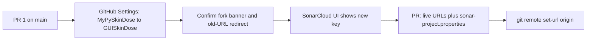

# GUISkinDose GitHub / Sonar / URL follow-up

**Status:** **Archived 2026-09-04 — complete.** GitHub fork renamed to `GUISkinDose`, SonarCloud
key flipped (`kgrizz-git_GUISkinDose`), live URLs/`sonar-project.properties` retargeted in PR #74,
fresh-clone/redirect check and `main` CI verified.
**Does not include:** in-repo `mypyskindose` → `guiskindose` imports (that is
[GUISKINDOSE_RENAME_PLAN.md](GUISKINDOSE_RENAME_PLAN.md)), fixture sanitization, TestPyPI, or
Trusted Publishing (those stay in
[GUISKINDOSE_PRIVACY_REPUBLICATION_PLAN.md](../GUISKINDOSE_PRIVACY_REPUBLICATION_PLAN.md)).

**TO_DO:** [TO_DO.md](../../TO_DO.md) Now/Next item "Rename the GitHub repository to GUISkinDose" (done).

This is the operational checklist for renaming the **existing** GitHub fork and then updating
live URLs and the SonarCloud project key. PyPI is not a prerequisite. Do **not** do this during
the mechanical-rename PR: CI, clone URLs, and `sonar-scan` would all move at once.

## Names

| Surface | Keep until this plan | After this plan |
|---------|----------------------|-----------------|
| GitHub repository | `kgrizz-git/MyPySkinDose` | `kgrizz-git/GUISkinDose` (product casing; GitHub is case-insensitive) |
| PyPI / import / CLI | `guiskindose` (set in PR 1) | unchanged here |
| SonarCloud `projectKey` | `kgrizz-git_MyPySkinDose` | `kgrizz-git_GUISkinDose` **only after** the Sonar UI shows that key |
| SonarCloud `projectName` | `MyPySkinDose` | `GUISkinDose` (same timing as the key) |
| ReadTheDocs slug | `mypyskindose.readthedocs.io` if that project exists | rename the RTD project first, then rewrite the URL; otherwise leave it |

Preserve upstream `github.com/rvbCMTS/PySkinDose` links, Semgrep rule IDs
(`mypyskindose-*`), and historical `CHANGELOG.md` sections through `[25.2.0]`.

## When to run

- **Do:** after [GUISKINDOSE_RENAME_PLAN.md](GUISKINDOSE_RENAME_PLAN.md) PR 1 is merged to `main`.
- **Do not:** mid-flight PR 1; do not rewrite live GitHub/Sonar strings in that PR.
- **Not blocked on:** first PyPI publish, or republication Phases 1–6 (fixture sanitization).
- **Privacy note:** renaming GitHub changes the public URL, not the history. The repo is already
  public as `MyPySkinDose`. If GUISkinDose should mean “sanitized launch,” finish republication
  Phases 6–7 privacy sign-off first. If the goal is only that the repo **name** matches the
  product while development continues, run this plan after PR 1.

If this plan has already landed when republication Phase 7 starts, Phase 7 is **verify-only** for
the fork rename (banner, redirects, remaining launch checks).

## Order (do not skip)

GitHub Settings rename → confirm SonarCloud key in the UI → small in-repo PR for URLs and
`sonar-project.properties` → update local `origin`. Changing `sonar.projectKey` before the
SonarCloud project matches **breaks** `sonar-scan` on `main`.

---

### Phase A — Rename the GitHub fork (Settings, not git)

Maintainer-only. Do not force-push, orphan, or filter history.

- [ ] Confirm `github.com/kgrizz-git/GUISkinDose` is free (GitHub names are case-insensitive).
- [ ] `main` is green on the mechanical-rename tip.
- [ ] GitHub → Settings → General → Repository name → **`GUISkinDose`**.
- [ ] Confirm GitHub still reports **forked from** [PySkinDose](https://github.com/rvbCMTS/PySkinDose).
- [ ] Confirm issues, PRs, stars, default branch, Actions, and branch protection survived.
- [ ] Confirm `https://github.com/kgrizz-git/MyPySkinDose` redirects to `GUISkinDose`.
- [ ] Optional: Topics, description, and social preview. Do not claim FDA clearance.
- [ ] Note: Trusted Publishing is not registered yet. When it is, the publisher must name
      `kgrizz-git/GUISkinDose`. Do not register against the old repo name if this rename is imminent.

Local clone directory may stay `MyPySkinDose`; that is not this plan.

---

### Phase B — SonarCloud, then `sonar-project.properties`

`.sonarcloud.properties` has **no** `projectKey` (Automatic Analysis binds via GitHub). The
CLI/`sonar-scan` job reads `sonar-project.properties`.

- [ ] Open SonarCloud for org `kgrizz-git`. After the GitHub rename, see whether the bound
      project key became `kgrizz-git_GUISkinDose` automatically.
- [ ] If the UI still shows `kgrizz-git_MyPySkinDose`, rename the SonarCloud project so the key
      **and** display name match `GUISkinDose` **before** any git change.
- [ ] Only then, in a follow-up PR, set:
      - `sonar.projectKey=kgrizz-git_GUISkinDose`
      - `sonar.projectName=GUISkinDose`
- [ ] Do not change exclusion lists here unless they already drifted.
      `scripts/check_sonar_properties.py` only compares shared exclusion keys with
      `.sonarcloud.properties`.
- [ ] After that PR reaches `main`, confirm `sonar-scan` ran (needs `SONAR_TOKEN`) and used the
      new key. `SONAR_PROTECTED_MAIN_ENABLED=true` is unchanged.

---

### Phase C — Live URL rewrite (same PR as the Sonar properties, or immediately after)

Rewrite **live** `github.com/kgrizz-git/MyPySkinDose` (and `kgrizz-git_MyPySkinDose`) after
Phase A (and Phase B for Sonar strings). GitHub redirects make old links work, but origin,
badges, and `pyproject.toml` should be explicit.

**Must update**

- [ ] `pyproject.toml` `[project.urls]` Homepage / Bug Tracker / Documentation
- [ ] `CITATION.cff` `repository-code` and `url` (keep the upstream PySkinDose reference)
- [ ] `README.md`, `CONTRIBUTING.md`, `SUPPORT.md`, `SECURITY.md`, `CODE_OF_CONDUCT.md`
      (GitHub advisory URL)
- [ ] `.github/ISSUE_TEMPLATE/*`, `.github/pull_request_template.md`
- [ ] `dev-docs/info/PACKAGE_INSTALL.md` (`git+https://…`)
- [ ] Changelog **footer** compare/release links under `[Unreleased]` / current tags — not the
      historical `[25.2.0]` prose
- [ ] `scripts/check_stale_brand.py`: **remove** `github.com/kgrizz-git/MyPySkinDose` and
      `kgrizz-git_MyPySkinDose` / `sonar.projectName=MyPySkinDose` from `ALLOWED_PATTERNS`
      once the live strings are gone. Keep this plan file, the mechanical rename plan, the
      republication plan, archive/assessments, and historical changelog allowlisted.
- [ ] Invert tests that currently treat those URLs/keys as “leave alone”
      (`tests/unittests/test_check_stale_brand.py`, `test_rewrite_package_paths.py`).
- [ ] `scripts/rewrite_package_paths.py` comment/regex that classifies the old GitHub URL as
      something to skip — after this plan it is stale.

**Optional / if the service exists**

- [ ] ReadTheDocs: rename the project slug first, then replace
      `mypyskindose.readthedocs.io` (today in `src/guiskindose/beam_class.py` after PR 1).
      If this fork has no RTD project, leave the URL and record that in the PR.
- [ ] Codecov / other dashboards bound to the GitHub repo — confirm after the Settings rename.
- [ ] Paseo / local tooling whose project id is `remote:github.com/kgrizz-git/MyPySkinDose`.

**Do not**

- Rewrite `github.com/rvbCMTS/PySkinDose`.
- Rewrite Semgrep `# nosemgrep: mypyskindose-*` or YAML `id: mypyskindose-*`.
- Blanket-sed `MyPySkinDose` in historical changelog or `COORD_TRANSFORM_COMPARISON.md`.

---

### Phase D — Remotes and verification

- [ ] `git remote set-url origin https://github.com/kgrizz-git/GUISkinDose.git` (or SSH equivalent)
      even though redirects work. Keep `upstream` → `rvbCMTS/PySkinDose`.
- [ ] Fresh clone of the **new** URL; old URL redirects.
- [ ] CI green on `main`, including `sonar-scan` if `SONAR_TOKEN` is present.
- [ ] `python scripts/check_stale_brand.py` fails on a leftover live old GitHub URL.
- [ ] Fork banner still present.
- [ ] Changelog Unreleased notes the GitHub/Sonar URL change (no version bump unless releasing).

Archive this plan under `dev-docs/plans/archive/` and update `dev-docs/index.md` when the
checklist is done.

## Out of scope

- First PyPI publish of `guiskindose` `1.0.0`
- Local folder rename `~/…/MyPySkinDose`
- Changing `LIVE_PACKAGE_NAME` (that is PR 1)
- Rewriting git history
