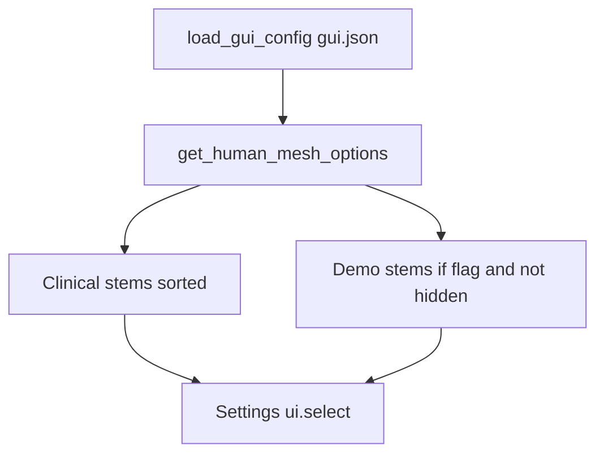

# Phantom QA, Demo Gate, and Bariatric Extremities Plan

> **Status (2026-07-22):** **Completed** — demo gate (local `gui.json`), Steamboat supine re-orient,
> pediatric 5y male reinstall, bariatric thick-extremities variants. Source execution plan mirrored from
> agent session; do not treat open checkboxes below as unfinished if status says Completed.

<!-- 93c4a963-2732-4bf7-9293-78d3ec1409ad -->
---
todos:
  - id: "demo-gate-gui"
    content: "Task 1: gui.json show_demo_phantoms gate, Demo section at end, hide Ramesses"
    status: pending
  - id: "steamboat-reorient"
    content: "Task 2: Rediscover Steamboat rotate_deg (Z roll), re-ingest, validate, inventory"
    status: pending
  - id: "pediatric-faceup"
    content: "Task 3: Fix pediatric_5y_male orientation + clinical face-up gate in run_catalog"
    status: pending
  - id: "bariatric-thick"
    content: "Task 4: Add bariatric_class2_*_thick_extremities catalog rows and ship meshes"
    status: pending
  - id: "docs-closeout"
    content: "Task 5: Docs, CHANGELOG, index/TO_DO, feature matrix"
    status: pending
isProject: false
---
# Phantom QA, Demo Gate, and Bariatric Extremities Plan

> **For agentic workers:** Use `superpowers:subagent-driven-development` (recommended) or `superpowers:executing-plans`. Mark checkboxes only after each step is verified.

**Goal:** Improve shipped phantom UX: demos off by default behind a local flag, Ramesses never listed, Steamboat re-rolled supine, pediatric 5y male face-up fixed, and new bariatric “thick extremities” variants alongside the current class-II meshes.

**Architecture:** GUI mesh options become an ordered clinical list + optional Demo section controlled by `show_demo_phantoms` in existing [`~/.mypyskindose/gui.json`](../../../src/guiskindose/gui/window_prefs.py) (not committed; default missing/false). Mesh binaries stay on disk; loaders still accept known stems. Clinical orientation fixes go through `transform_to_psd_frame` / catalog regenerate; Steamboat via fun-manifest `rotate_deg` rediscovery. Bariatric limb-bulk rows are new `catalog_v1.json` IDs generated with MPFB detail targets, keeping `bariatric_class2_*` unchanged.

**Tech stack:** NiceGUI `ui.select`, `window_prefs.load_gui_config` / `save_gui_config`, `scripts/phantom_gen/` (fun ingest + MPFB catalog), pytest.

## Locked decisions

| Topic | Decision |
|-------|----------|
| Cosmic Buddha | Keep files; list only in Demo section when flag on; label notes headless |
| Ramesses II | Keep files + NOTICE; **never** list in GUI (even with flag on) — stone/plinth quality |
| Steamboat Willie | Keep; re-ingest with corrected roll so supine (not right-side); Demo-gated |
| Demo visibility | `show_demo_phantoms` in `~/.mypyskindose/gui.json`, **default off** when missing |
| Demo dropdown UX | Clinical meshes first (alpha), then non-selectable `── Demo ──` separator, then demos |
| Pediatric 5y male | Fix orientation (and add clinical face-up gate so it cannot ship face-down again) |
| Bariatric | Keep `bariatric_class2_{male,female}`; add `bariatric_class2_{male,female}_thick_extremities` |

## File map

| File | Role |
|------|------|
| [`src/guiskindose/gui/window_prefs.py`](../../../src/guiskindose/gui/window_prefs.py) | Read/write `show_demo_phantoms` on existing `gui.json` |
| [`src/guiskindose/gui/helpers.py`](../../../src/guiskindose/gui/helpers.py) | `GUI_HIDDEN_HUMAN_MESHES`, ordered `get_human_mesh_options()`, demo gate |
| [`src/guiskindose/gui/tabs/settings.py`](../../../src/guiskindose/gui/tabs/settings.py) | Wire select options; reject selecting separator key |
| [`scripts/phantom_gen/fun_mesh_manifest.json`](../../../scripts/phantom_gen/fun_mesh_manifest.json) | Steamboat `rotate_deg` rediscovery + lock |
| [`scripts/phantom_gen/catalog_v1.json`](../../../scripts/phantom_gen/catalog_v1.json) | New thick-extremities rows; pediatric regen if needed |
| [`scripts/phantom_gen/run_catalog.py`](../../../scripts/phantom_gen/run_catalog.py) | Clinical face-up validation step |
| [`scripts/phantom_gen/validate_phantom.py`](../../../scripts/phantom_gen/validate_phantom.py) | Optional side-lying / face-up helpers for clinical path |
| Docs: `CHANGELOG`, `AGENTS`, `ADDITIONAL_PHANTOMS`, `FEATURE_INVENTORY`, help, `TO_DO`, `index.md` | Status + how to enable demos |



---

### Task 1: Demo gate + dropdown section + hide Ramesses

**Files:** `window_prefs.py`, `helpers.py`, `constants.py`, `settings.py`, `tests/unittests/test_demo_phantoms_integration.py` (extend), new small unit tests for prefs key

- Add `show_demo_phantoms: bool` helper:

```python
def show_demo_phantoms_enabled() -> bool:
    return bool(load_gui_config().get("show_demo_phantoms", False))
```

- Split sets in `helpers.py`:
  - `DEMO_HUMAN_MESHES` = `{cosmic_buddha, steamboat_willie}` (and future demos)
  - `GUI_HIDDEN_HUMAN_MESHES` = `{ramesses_ii}` (never listed)
- `get_human_mesh_options()` returns **insertion-ordered** dict:
  1. Non-demo, non-hidden stems → title-case labels
  2. If demos enabled and any demo present: sentinel key `"__demo_section__"` → label `"── Demo ──"`
  3. Demo stems with `(demo)` labels (Cosmic: `"Cosmic Buddha (demo, headless)"`)
- Settings select: if user somehow picks separator, ignore / snap back to previous; document that Quasar may still allow click — filter in `on_change`.
- Update tests: default options exclude demos + Ramesses; with monkeypatched config `show_demo_phantoms=True`, Cosmic/Steamboat appear after separator; Ramesses still absent.
- Docs: one sentence in `docs/source/gui_help/phantom_preview.md` — enable demos by setting `"show_demo_phantoms": true` in `~/.mypyskindose/gui.json`.
- CHANGELOG + commit.

**Manual enable (not committed):**

```json
{ "show_demo_phantoms": true }
```

---

### Task 2: Re-orient Steamboat Willie (side → supine)

**Files:** `fun_mesh_manifest.json`, `fun_phantom_provenance.md`, shipped `steamboat_willie*.stl`, inventory hashes, tests

- Discovery under `tmp/fun_phantoms/` with `--preview-only`: try `rotate_deg` rolls about Z (`[0,0,±90]` / combinations with existing `flip_y`) until Settings/visual smoke shows back on table, face up, **not** on right side.
- Strengthen fun validate if needed: e.g. require superior headband **lateral span** ≪ AP thickness (side-lying fails), or document a second gate; do not weaken face-up.
- Re-ingest → reduced → privacy admission → update provenance + inventory hashes.
- Smoke: `siemens_axiom_example_procedure.dcm` anterior entrance/exit; GUI preview with demos enabled.
- Commit mesh + docs.

---

### Task 3: Fix pediatric 5y male face orientation

**Files:** `run_catalog.py` / transform path, possibly `catalog_v1.json`, shipped `pediatric_5y_male*.stl`, inventory, assessments note

- Confirm in Settings preview vs `pediatric_5y_female` (current numeric face-up heuristic alone can be misleading).
- Fix by regenerating through catalog with corrected AP flip (today [`run_catalog.py`](../../../scripts/phantom_gen/run_catalog.py) always `force_flip_y=True` — add per-entry override if only male is wrong, e.g. `"force_flip_y": false` in catalog expect/meta).
- Add **clinical** face-up check in `run_catalog` validate (reuse `face_up_ok` from `validate_phantom.py`) so P0 regen fails closed if face-down.
- Reinstall STL + reduced, update inventory hashes, short assessment or provenance note.
- Unit/integration: mesh still loads; optional synthetic test for catalog face-up step.
- Commit.

---

### Task 4: Bariatric thick-extremities variants (keep current)

**Files:** `catalog_v1.json`, `mpfb_generate.py` (only if target discovery helper needed), new STLs, `AGENTS.md` mesh list, tests, inventory

- Keep existing `bariatric_class2_male` / `_female` unchanged.
- Add catalog IDs:
  - `bariatric_class2_male_thick_extremities`
  - `bariatric_class2_female_thick_extremities`
- Clone class-II macros; **add** MPFB detail targets for arms, legs, neck, head bulk (discover exact target basenames from the local MPFB install under the extension’s target tree — names like `*-scale-*-incr` / measure circumferences; record chosen names + weights in catalog). Do **not** remove abdomen-dominant targets; extremities are additive.
- Generate → validate (extents + `abdomen_bulk` still meaningful; add simple limb/neck radial band metrics or visual gate documented in assessment) → reduced → install → privacy admission.
- GUI labels: title-case from stem (clinical list, not demos).
- Integration tests discover/load new stems.
- CHANGELOG (minor SemVer on release); commit.

---

### Task 5: Docs / plan registration close-out

- Update [`dev-docs/TO_DO.md`](../../TO_DO.md), [`dev-docs/index.md`](../../index.md), [`ADDITIONAL_PHANTOMS.md`](../../ADDITIONAL_PHANTOMS.md), [`FEATURE_INVENTORY.md`](../../FEATURE_INVENTORY.md), `feature_doc_matrix` if needed.
- Note Ramesses still on disk for CLI/`Phantom(human_mesh=...)` but GUI-hidden; demos opt-in via local prefs.
- Register this plan under active plans in `index.md`.

---

## Acceptance criteria

1. Fresh install / empty `gui.json`: Settings mesh dropdown shows **no** demo meshes and **no** Ramesses.
2. With `"show_demo_phantoms": true`: Demo separator + Cosmic (headless label) + Steamboat at **end**; Ramesses still absent.
3. Steamboat visually supine (not right-side); fun validate + smoke pass; inventory hashes updated.
4. Pediatric 5y male face-up in Settings preview; catalog face-up gate enforced.
5. Both original and `_thick_extremities` bariatric pairs load; originals unchanged on disk unless untouched hashes prove so.
6. No secrets/paths logged; privacy admission for new/changed binaries; CHANGELOG Unreleased updated.

## Out of scope

- Deleting Ramesses/Cosmic STLs from the repo
- Venus/David (D1) / Petite unblock
- Git LFS or undecimated museum scans
- Shipping `"show_demo_phantoms": true` in any committed config
